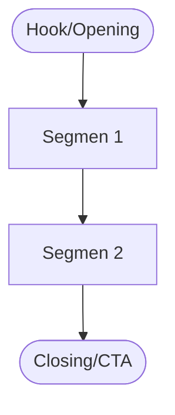

# 🎬 IDE KREATIF TEMPLATE (Konten, Game, Event, Eksperimen Konsep)

> Fokus pada konsep, pengalaman, dan alur ide. Hapus bagian yang tidak relevan.

---

## 1) Ide Utama
- **Judul/Nama:** 
- **Deskripsi Singkat:** 
- **Genre/Theme/Vibe:** 
- **Tujuan Pengalaman:** 

---

## 2) Target Audience
- **Siapa yang Ditarget:** 
- **Tone & Gaya Visual:** 

---

## 3) Core Concept
- **Narasi Inti / Hook:** 
- **Experience Flow:** (awal → tengah → akhir)

---

## 4) Desain / Storyboard
- **Visualisasi:** sketsa/flow/struktur
- **Scene/Segment Breakdown:** 

---

## 5) Resource Plan
- **Tim/Kolaborator:** 
- **Tools/Alat Produksi:** 
- **Budget (opsional):** 

---

## 6) Timeline
| Step | Aktivitas | Deadline | Status |
|------|-----------|----------|--------|
| 1    |           |          |        |
| 2    |           |          |        |

---

## 7) Output
- **Format Akhir:** (video/demo/prototype/event/tulisan)
- **Platform Publikasi/Distribusi:**
