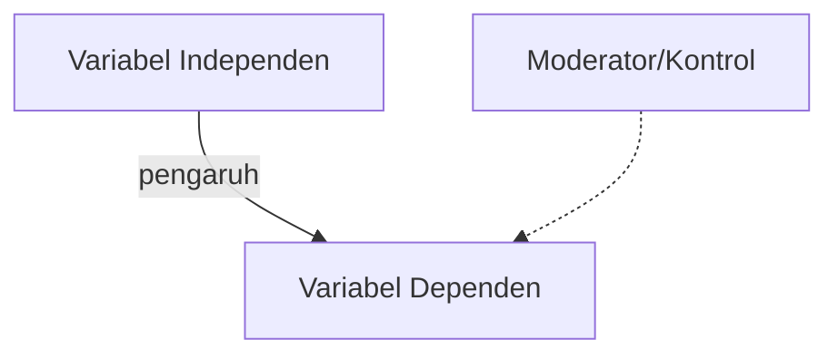

# 📚 SKRIPSI / PENELITIAN TEMPLATE

> Sesuaikan dengan pedoman kampus/jurnal. Hapus bagian yang tidak relevan.

---

## 1) Identitas Penelitian
- **Judul:** 
- **Bidang / Topik:** 
- **Latar Belakang:** 
- **Tujuan Penelitian:** 
- **Status:** (perancangan / pengumpulan data / analisis / selesai)

---

## 2) Rumusan Masalah & Hipotesis
- **Pertanyaan Penelitian:** 
- **Hipotesis (jika ada):** 

---

## 3) Batasan & Variabel
- **Scope Penelitian:** 
- **Variabel:** (independen, dependen, kontrol)
- **Asumsi / Batasan:** 

---

## 4) Metodologi
- **Jenis Penelitian:** (kualitatif/kuantitatif/eksperimen)
- **Desain Penelitian:** 
- **Populasi & Sampel / Subjek:** 
- **Instrumen & Pengumpulan Data:** (kuesioner, observasi, log, sensor)
- **Teknik Analisis:** (statistik, uji signifikan, analisis tematik)

---

## 5) Framework / Model Konseptual
- **Diagram Model:** relasi variabel & alur sebab-akibat

---

## 6) Implementasi / Perangkat (opsional)
- **Arsitektur/Alat:** 
- **Dataset / Sumber Data:** 
- **Tools/Software:** 

---

## 7) Hasil & Analisis
- **Temuan Utama:** 
- **Interpretasi & Pembahasan:** 

---

## 8) Kesimpulan & Rekomendasi
- **Kesimpulan:** 
- **Saran untuk Penelitian Lanjutan:** 

---

## 9) Referensi
- **Gaya sitasi:** (APA/IEEE/MLA, dll)
- **Daftar Pustaka:** 

---

## 10) Timeline
| Tahapan | Kegiatan | Estimasi Waktu | Status |
|---------|----------|----------------|--------|
| 1       |          |                |        |
| 2       |          |                |        |
