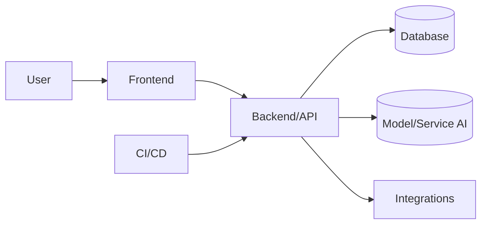

# 🧠 TECH PROJECT TEMPLATE (Aplikasi / Website / AI / Automation)

> Tinggal duplikasi & isi. Hapus bagian yang tidak relevan.

---

## 1) Overview
- **Nama Proyek:** 
- **Jenis:** (app/web/LLM/tool/etc)
- **Tujuan Utama:** 
- **Status:** (ide / prototype / MVP / release)

---

## 2) Problem & Solution
- **Masalah Pengguna:** 
- **Solusi yang Diajukan:** 
- **Value Utama:** 

---

## 3) Target User & Use Case
- **Persona Pengguna:** 
- **Use Case Utama:** 
  - UC-1: 
  - UC-2: 

---

## 4) Core Features
| No | Fitur | Deskripsi Singkat | Prioritas (High/Med/Low) |
|----|-------|-------------------|---------------------------|
| 1  |       |                   |                           |
| 2  |       |                   |                           |
| 3  |       |                   |                           |

---

## 5) System Design
- **Arsitektur:** (frontend–backend–database–AI–API–cloud)
- **Diagram (opsional):** draw.io / Figma / Excalidraw / Mermaid

---

## 6) Tech Stack
| Layer | Tools/Framework | Catatan |
|-------|------------------|---------|
| Frontend |                |         |
| Backend  |                |         |
| Database |                |         |
| AI / ML  |                |         |
| Cloud / Hosting |         |         |
| Version Control |         |         |
| Observability |           |         |

---

## 7) Data Flow / Workflow
- **Data Flow:** input → proses → output
- **API Utama:** (endpoint, method, payload, response)
- **AI Pipeline (jika ada):** preprocessing → inference → postprocessing

---

## 8) Security & Scalability
- **AuthN/AuthZ:** (JWT/OAuth/Keycloak, RBAC/ABAC)
- **Proteksi Data:** (enkripsi at-rest/ in-transit, hashing)
- **Scalability:** (horizontal, caching, load balancer)
- **Monitoring:** (Grafana, Prometheus, Sentry, OpenTelemetry)

---

## 9) Timeline
| Phase | Deliverable | Estimasi Waktu | Status |
|-------|-------------|----------------|--------|
| 1     |             |                |        |
| 2     |             |                |        |

---

## 10) Next Steps
- **Pengujian/QA:** 
- **Deployment:** 
- **Dokumentasi:**
